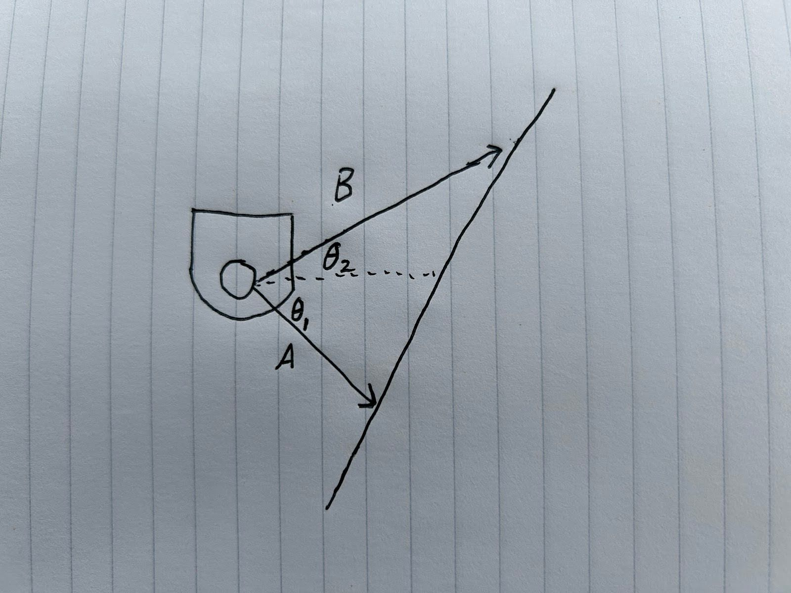

**Warmup Project: CompRobo FA24**

**Ari Bobesh, Will Young**

**Contents**


* **Nodes**
    * **Teleop**
    * **Drive Square**
    * **Wall Following**
    * **Person Follower**
    * **Obstacle Avoidance**
    * **Finite State Machine**
* **Code Structure**
* **Improvement**
* **Key Takeaways**


**Teleop**

Summary:

The goal of the teleop script is to allow the robot to be driven using the user’s keyboard. We chose to try to make the script usable with only WASD instead of the more complex teleop sample. We were limited by the ability to read only one keypress from the terminal at any given time, so we implemented a gradual ramp up and ramp down for the robot speed to allow for linear and angular mixing by mashing the WASD keys quickly in short succession.

Features:


* Instantaneous braking by pressing the button for the other direction.
* Slow start acceleration.
* Slow stop deceleration.
* Speed mixing to allow for both linear and angular motion without hitting the Neato’s speed limit.

Downsides:


* The behavior is a little bit hard to learn because the code does not read very rapidly from the terminal, so getting combined motion requires not just quick fingers, but proper timing as well. It would be nice if multiple key presses could be read from the terminal at once.

Challenges:


* Making the terminal monitoring be unblocking was difficult. Our final result required ```select.select([sys.stdin], [], [], 0) == ([sys.stdin], [], [])``` in order to check for whether data is in the terminal before reading.


**Drive Square**

The goal of this program was for the Neato to drive in a 1-meter by 1-meter square indefinitely, as shown below.


We considered two main approaches to this. The first approach was to tell the robot to drive forward for the amount of time it would take to reach 1 meter, and then turn left for the amount of time it would take to turn 90 degrees. The second approach was to use the Neato’s on-board odometry to plan the movements. As we were more interested in spending time on the robot’s other behaviors, we selected the first approach. 

The DriveSquareNode works by initializing a counter that tracks the time that has elapsed. The loop then checks the value of that counter and sends the robot a message to either go forward, turn left, or wait. Which message is determined by the modulo of the counter’s value and the time required to complete a full cycle (going forward, stopping, turning left, and stopping). Therefore, once the robot has completed a full cycle, the result of the operation will return to zero and the loop will start again.

The main challenge with this behavior was the difference between the simulated and actual behavior of the Neato, as what appears to be a 90 degree turn in Gazebo is not a 90 degree turn on the physical Neato. This meant that we had to spend some time tuning the durations and speeds of the Neato’s turns in order to get a realistic square.


**Wall Following**

The goal of this program is for the Neato to drive parallel to a wall, as shown in the figure below.


The first step towards this goal is to determine if the wall to follow is on the left or right side of the robot. In order to do this, the Neato takes a LIDAR scan and finds the closest point. If the closest point is on the left side of the robot (0 -179 degrees), then the wall is assumed to be on that side of the robot, and likewise, if the closest point is on the right side of the robot then the wall is assumed to be on the right side.

Once we know what side our wall is on, we can use two of the points from our LIDAR scan to distinguish the position of the wall, as shown below.





We can then convert the LIDAR data points (which are in polar coordinates) and convert them to cartesian coordinates (with the Neato as the origin of our coordinate frame), which makes it easier to calculate the direction of the wall.


Once we have our two cartesian points of our wall, we can calculate the direction of the wall, and can then find the angle between the neato’s heading and that direction. Once we have this angle (represented by θ<sub>correction</sub> in the figure below), we can send a correction message to the neato that is proportional to that angle (with the proportionality controlled by the Kp constant). 

The biggest challenge with this behavior was fully understanding the geometry of the problem. It took at least 3 or 4 failed diagrams to correctly work out all the math of the coordinate transforms and angle calculations. However, once the math was worked out, the implementation was relatively straightforward.


**Person Follower**

Summary:

The goal of the person follower was to successfully track a person, which is hard because a person is a moving object and our environment is very noisy. This task was further made more difficult by removing the restriction of the person being in front of the robot and attempting full 360-degree person tracking.

Strategy:

We applied a tuned kernel to the adjusted laser scan in order to isolate the most likely candidate in the environment that is a person. This kernel applies strong positive weights to small objects, but for wide objects applies even stronger negative weight. The laser scan is adjusted in three primary ways: 1) the scan’s values are inversed to apply a more positive weight to closer points and a zero weight to infinitely far points, 2) the ±15-degree window in front of the robot is positively biased to encourage tracking of objects in front of the robot, and 3) the last five directions of detected POIs are positively biased based on recency. In sum, these biases allow for the behavior to be tuned beyond the kernel itself in a more fine way.

When the kernel detects a POI direction, this is saved into a list of the last five POI directions, which is constantly updated based on the robot’s heading change between measurements. Then, the robot calculates the direction/speed it should aim for as a simple average of these five directions. The speed is further modified to be proportional to the angle deviation between the current and desired direction and limited to a magnitude of 0.7 to make the robot’s behavior less erratic. The speed maximum could be increased, but only if the window for averaging the POI directions was made larger to compensate.

Finally, the robot’s linear speed is calculated as a function of the average scan distance at the front of the robot across a ±20-degree arc.

Features:


* A very strong fear of walls.
* Follows legs of all types (does not discriminate between chairs and humans).
* Cute movement.

Downsides:

The kernel approach has the downside of having differing behavior for different orientations of the person and different distances, but can still be pretty reliable. For a more relaxed kernel, a wider kernel with a lot of 0 values between the positive middle and negative outlier weights could help mitigate these behavioral differences. The other downside of this approach is that occlusion is a factor whereby a person-shaped object that is overshadowed by a larger wall-shaped object behind it may be disregarded. This is why the robot tends to drive around you and then park itself facing you in between you and the wall in an attempt to minimize the wall’s contribution to the gradient. Finally, there are some person-shaped objects in the room that are enough to trick the kernel by itself, but the pre-processing helped eliminate noise as well as reducing the robot’s speed.

The front scan averaging for the linear speed has the downside of returning a high value if the object in front of the robot is too small and for the robot to hit the object. This could be resolved by using the minimum value, but might require some extra checks to ensure that small outliers don’t cause issues.

Challenges:


* Getting the kernel right.
* Correcting the heading.
* Tuning the weights of different biases depending on simulation vs. real-life environments.


**Obstacle Avoidance**

The goal of this program is for the Neato to detect and then avoid any obstacles in its path.

The way we ultimately implemented this behavior was based on the concept of potential fields. In an electric potential field, electrically charged particles all repel each other. We can apply this concept to obstacle avoidance by treating any obstacles the robot detects (as determined from a LIDAR scan) as “particles” that exert a repellant force on a robot. If we combine all these forces and add a force “pulling” the robot forward, this leaves us with a direction vector for the robot to move in that will avoid all obstacles. A demonstration of how this works is in the figure below.


In order to make the obstacle avoider more effective, we had to make some additional modifications to the basic potential field concept. First of all, we focused only on the LIDAR readings from 35 to -35 degrees, as LIDAR readings outside of 35 degrees are not actually “obstacles” and do not obstruct the neato’s path forward. Additionally, we decided to weight the data points that were more directly in front of the robot more strongly than those near the edges of its field of view, as avoiding those obstacles required much more drastic trajectory adjustments. We also decided to make the strength of each repelling vector inversely proportional to the square of the distance that point was away from the robot, creating a quadratic relationship instead of a linear relationship. This decision was based on the inverse-square law, a concept within science that, according to Wikipedia, states that “the ‘intensity’ of a specified physical quantity is inversely proportional to the square of the distance from the source of that physical quantity”. These modifications all increased the effectiveness of the obstacle avoidance node.


**Finite State Machine**

Summary:

The finite state machine implements a new feature for backing away from objects it hits while trying to do person following. The two states are: 1) person following, and 2) backing up. The state transitions are: 1) when the Neato is bumped, transition to backing up, and 2) after 4 seconds of backing up, transition to person following.


Strategy:

The person follower code and the back away code were both copied into the finite state machine node. The finite state machine kept track of the state and would only allow one of the two features to publish at any given time. However, both features were allowed to read continuously and process continuously to avoid any weird discontinuities from restarting a feature.

Features:


* Person following
* Backing away from objects it hits
* Seamless transitions

Downsides:


* A lot of code in one file
* Changes to the person follower node don’t propagate to the finite state machine
* Naming conflicts between variables quite frequent

Challenges:


* We tried using subprocess to spawn and then kill nodes instead of putting all the code in the FSM, but this was not feasible because the processes refused to be killed.
* We tried to import the nodes and run them with rclpy, but the commands were always blocking, causing the FSM to lock up.

**Code Structure**

The code in the repository is structured into independent nodes that are meant to run independently:


* finite_state_controller
* obstacle_avoider
* person_follower
* square
* teleop
* wall_follower

These nodes communicate with the robot via the standard message types:


* Bump
* LaserScan
* Twist

**Improvement**

The code could be improved by building it as a network instead of individual nodes. Currently, the structure is not conducive to connecting multiple behaviors into one cohesive control system. Furthermore, the code could be improved by creating custom message types for inter-node communication. Because of how short the project was, we also did not have the chance to play around with these custom messages and fancy visualizations, which could definitely help tune the robot more effectively in conjunction with recorded bag files. Speaking of which, is it possible to run a bag file and a node at the same time? If we took a teleop drive around the classroom and then played it back in RViz with the person follower node running, could we inject the algorithm’s desired path calculated from the bagged LaserScan onto the RViz as a vector while RViz shows the bagged LaserScan? This could really help understand the inner workings of the algorithm without using a simulated environment that comparatively is much less true-to-life.

**Key Takeaways**

One key takeaway is that when it comes to understanding what the robot is doing, visualization is your best friend. This was especially apparent when we were working on the obstacle avoidance node and the robot kept running into a table that we were using as an obstacle. After probably 20 or 30 minutes trying different parameter values to get the robot to avoid the table, we finally visualized the robot’s LIDAR readout and realized that the table was not being picked up very well by the LIDAR sensor (likely due to its reflectivity). We were able to quickly deal with this problem by wrapping paper around the table, and if we had looked at our visualizations earlier it would have significantly reduced our debugging time. 

Another key takeaway is that it is important to account for unreliable sensors when programming robots. This was a major challenge with our wall-follower code, as the Neato’s LIDAR sensor data would often be incomplete or missing points (even if there was actually an object there). This meant that we had to include multiple data points for the Neato to choose from in order to ensure that it could successfully locate a wall.
